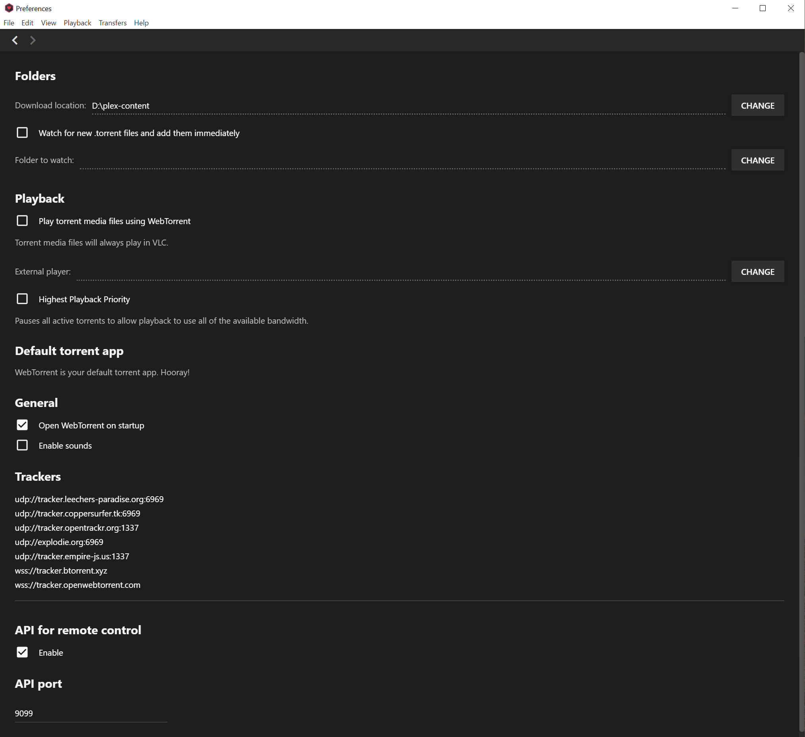
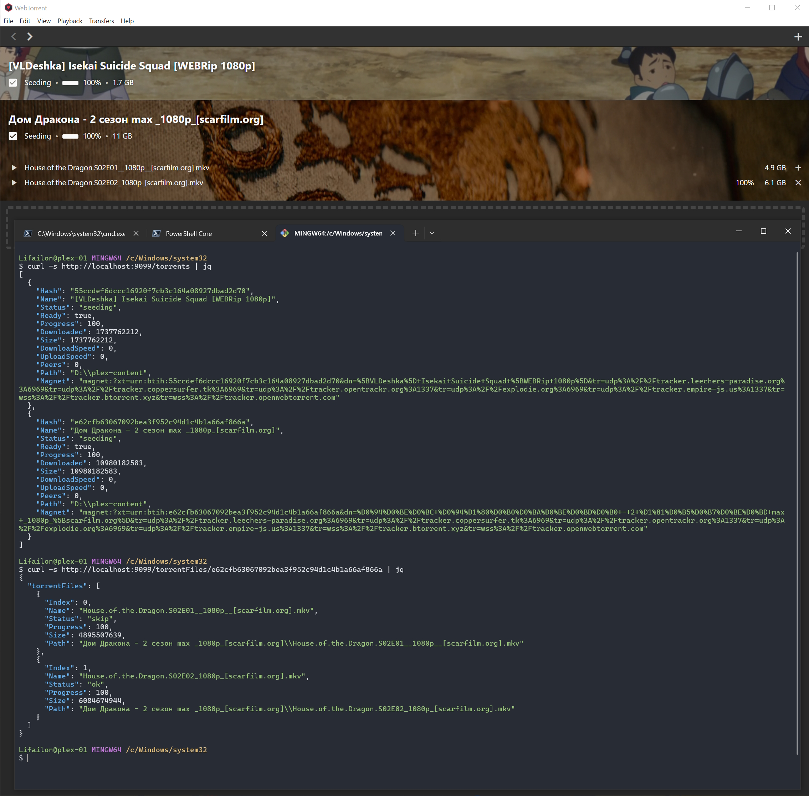

<h1 align="center">
    <a href="https://webtorrent.io">
        
    </a>
    <br>
    WebTorrent Desktop api
</h1>

The repository is a branch (fork) of the original version of ❤️ [WebTorrent Desktop](https://github.com/webtorrent/webtorrent-desktop), which add a remote control mechanism via the **REST API** on base [Express Framework](https://github.com/expressjs/express).

The source code (as well as telemetry) **has not changed**, the description provides [instructions](#-build) for merging and assembling with the original version.

## ⚙️ Updated preferences

<h1 align="center">
</a>
</h1>

To start the API server, click the `Enable` checkbox (no application restart required).

Defualt port `9099`. When you change the port, you must disable and enable the API for the changes to take effect.

## 📚 Endpoints

The current version implements 15 endpoints:

- Method: `GET`
   - `/stats` - Get a list of current client settings, torrent statistics and system information
   - `/torrents` - Get a list of added torrents, as well as download status and details
   - `/torrent/<hash>` - Get the information of the selected torrent by its info hash
   - `/torrentFiles/<hash>` - Get a list of files of the selected torrent
- Method: `POST`
    - `/pauseAllTorrents` - Pause all torrents
    - `/resumeAllTorrents` - Resume downloading all torrents
    - `/prioritizeTorrent` - Pause all torrents exception the selected one
        - Data: `hash` : `<string>`
    - `/resumePausedTorrents` - Resume all torrents from pause
    - `/toggleTorrent` - Set download status for selected torrent (paused or download)
        - Data: `hash` : `<string>`
    - `/toggleTorrentFile` - Set the download status of the selected file for the specified torrent (skip or download)
        - Data: `hash` : `<string>`
        - Data: `index` : `<int>`
    - `/toggleAllTorrentFile` - Set download status for all files from a torrent
        - Data: `hash` : `<string>`
    - `/addTorrent` - Add new torrent for download from `info hash` or `url`
        - Data: `source` : `<string>`
    - `/deleteTorrent` - Delete the selected torrent from the client (if `true`, remove downloaded data from the system)
        - Data: `hash` : `<string>`
        - Data: `deleteData`: `<boolean>`
    - `/createTorrent` - Create a torrent from a file or directory with files
        - Data: `path` : `<string>`
    - `/saveTorrentFile` - Download `.torrent` file
        - Data: `hash` : `<string>`

To get a list of files for further creation of a torrent from a remote Windwos system, you can use the 🔎 [Everything api](https://www.voidtools.com/support/everything/http).

## 🔌 Example

The example uses two queries to retrieve torrent list information and files of the selected torrent.

<h1 align="center">
</a>
</h1>

## 🚀 Build

#### Clone this and the original repository:

```
git clone https://github.com/webtorrent/webtorrent-desktop.git
git clone https://github.com/Lifailon/webtorrent-desktop-api.git
```

#### Copy the files that were updated to the original repository:

```
cp "webtorrent-desktop-api/src/renderer/main.js" "webtorrent-desktop/src/renderer/main.js"
cp "webtorrent-desktop-api/src/renderer/pages/preferences-page.js" "webtorrent-desktop/src/renderer/pages/preferences-page.js"
```

#### Install dependencies:

```
cd webtorrent-desktop
npm install
npm install express
```

#### Compare changes:

```
git diff
```

#### Run the app:

```
npm start
npm run watch
```

#### Run tests:

```
npm test
npm run test-integration
```

#### Package the app for all platform:

```
npm run package
```
